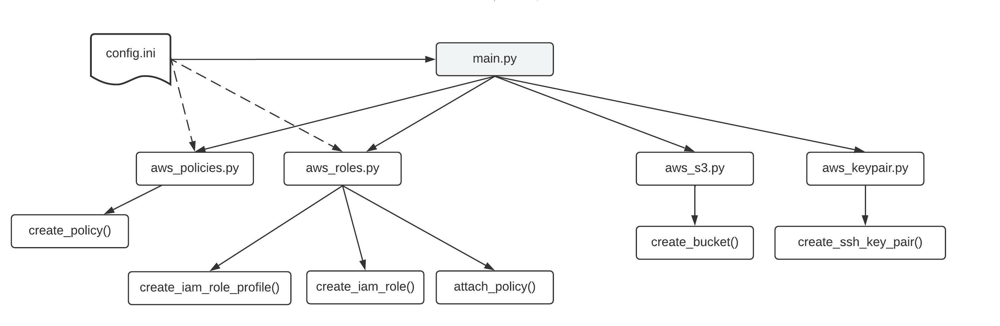

# Automating CDP Environment Registration On AWS

CDP currently requires certain AWS resources to be created manually before an Environment can be registered. The initial setup of Credentials, SSH Keypair along with the required [minimal setup for cloud storage](https://docs.cloudera.com/cdp/latest/requirements-aws/topics/mc-idbroker-minimum-setup.html#mc-idbroker-minimum-setup) are steps that need to be taken for each individual CDP user. 

Our project aims at reducing the manual steps of creating resources on AWS and registering an Environment on CDP using the CDP CLI and Boto3 library.`

## Execution Flow Diagram 

