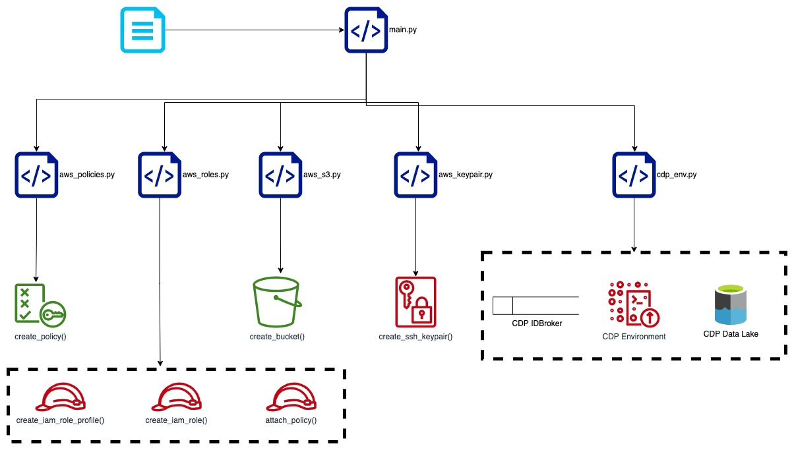

- # Automating CDP Environment Registration On AWS

- [Introduction](#introduction)
- [Using the Script](#using-the-script)
  - [Prerequisite](#prerequisite)
  - [Running the Script](#running-the-script)
- [Execution Flow Diagram](#execution-flow-diagram)
  
## Introduction
CDP currently requires certain AWS resources to be created manually before an Environment can be registered. The initial setup of Credentials, SSH Keypair along with the required [minimal setup for cloud storage](https://docs.cloudera.com/cdp/latest/requirements-aws/topics/mc-idbroker-minimum-setup.html#mc-idbroker-minimum-setup) are steps that need to be taken for each individual CDP user. 

Our project aims at reducing the manual steps of creating resources on AWS and registering an Environment on CDP using the CDP CLI and Boto3 library. 
## Using the Script

### Prerequisite

1. Install required Python packages
   The script utilizes the below Python 3 packages
   - boto3
   - json
   - configparser
   - halo
   - time 
   - os
2. Install and configure [AWS CLI](https://docs.aws.amazon.com/cli/latest/userguide/getting-started-install.html)
3. Install and configure [CDP CLI](https://docs.cloudera.com/cdp/latest/cli/topics/mc-installing-cdp-client.html)
4. Create [CDP Credential for AWS](https://docs.cloudera.com/management-console/cloud/credentials-aws/topics/mc-create-role-based-credential.html)
5. Clone the repository
### Running the Script

1. Edit the config.ini file 
   The config.ini file acts as the central repository for all configurations which will be used to create the resources and environment. 
   ```
   [S3]
   S3_BUCKET=mboq1-cdp-boto3
   S3_BUCKET_ARN=arn:aws:s3:::mboq1-cdp-boto3

   [NAMES]
   AWS_ACCOUNT_ID=268282262010
   USERNAME_PREFIX=mboq1_boto3_
   ID_BROKER_ROLE_NAME=mboq1_boto3_ID_BROKER_ROLE
   LOG_ROLE_NAME=mboq1_boto3_LOG_ROLE
   RANGER_AUDIT_ROLE_NAME=mboq1_boto3_RANGER_AUDIT
   DATALAKE_ADMIN_ROLE_NAME=mboq1_boto3_DATALAKE_ADMIN
   KEYPAIR_NAME=mboq1_boto3_keypair
   
   [CDP_NAMES]
   ENV_NAME="mboq1-boto3-env"
   CREDENTIAL_NAME="ankity-credentials"
   REGION="us-east-2"
   CIDR="10.10.0.0/16"
   DATALAKE_NAME="mboq1-boto3-datalake"
   DATALAKE_SIZE="LIGHT_DUTY"
   DATALAKE_RUNTIME="7.2.14"
   ```
2. Use python3 to execute the main.py file
   ```
   python3 main.py
   ```
## Execution Flow Diagram 



The main.py script imports other scripts and configurations. Once imported, the main.py file calls individual functions to create resources with the configurations as the parameters for them.

