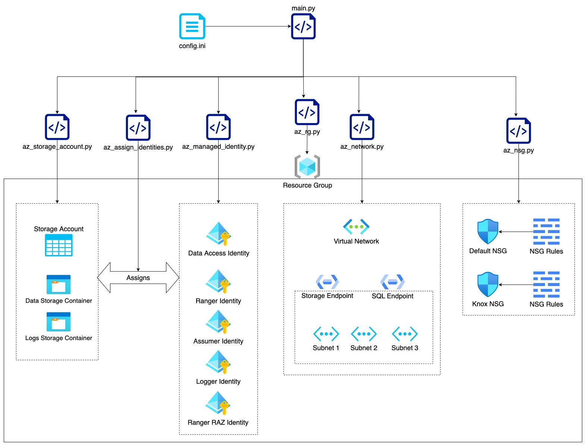

# Automating CDP Environment Registration On Azure

The main.py script imports other scripts and configurations. Once imported, the main.py file calls individual functions to create resources with the configurations as the parameters for them.

## Steps for running script

1. Setup [Azure CLI](https://docs.microsoft.com/en-us/cli/azure/install-azure-cli-macos)
2. [Sign in to Azure CLI](https://docs.microsoft.com/en-us/cli/azure/get-started-with-azure-cli#how-to-sign-into-the-azure-cli)
3. [Setup CDP CLI](https://docs.cloudera.com/cdp-public-cloud/cloud/cli/topics/mc-installing-cdp-client.html)
4. [Install jq](https://stedolan.github.io/jq/download/)
5. Create Azure Subscription
6. Create Azure App
Run below command on Azure CLI
```
az login
```

```
   az ad sp create-for-rbac \
     --name http://q2-mbo \
     --role Contributor \
     --scopes /subscriptions/da35404a-2612-4419-baef-45fcdce6045e
```

7. Create CDP Credential
Run below command using CDP CLI

```
cdp environments create-azure-credential \
--credential-name <credential_name?> \
--subscription-id  <subscription_id>\
--tenant-id <tenant_id> \
--app-based applicationId=<applicaiton_id>, \
secretKey=<app_password>
```
8. Create SSH Keypair

```
ssh-keygen -m PEM -t rsa -b 4096
```   

9.  Configure config.ini file with required fields. Please add subnet names and CIDRs in a comma separated list without any spaces. Below is an example config.ini 

```
[AZURE]
SUBSCRIPTION_ID=da35404a-2612-4419-baef-45fcdce6045e
RGNAME=q2-mbo-code
LOCATION=eastus
ASSUMER_ROLE_NAME=q2-mbo-AssumerIdentity-code
LOG_ROLE_NAME=q2-mbo-LoggerIdentity-code
RANGER_AUDIT_ROLE_NAME=q2-mbo-RangerIdentity-code
DATALAKE_ADMIN_ROLE_NAME=q2-mbo-DataAccessIdentity-code
RANGER_RAZ=q2-mbo-RangerRaz-code
VNET_NAME=q2-mbo-vnet-code
VNET_CIDR=10.10.0.0/16
NUMBER_OF_SUBNETS=3
SUBNET_NAMES=q2-mbo-subnet1-code,q2-mbo-subnet2-code,q2-mbo-subnet3-code
SUBNET_PREFIXES=10.10.0.0/24,10.10.1.0/24,10.10.2.0/24
DL_SUBNET_NAME=q2-mbo-subnet1-code
STORAGE_ACCOUNT=q2mbosacode
DATALAKE_CONTAINER=data-code
LOGS_CONTAINER=logs-code
```

10.  Run the following command to execute Script

```
python3 main.py
```

